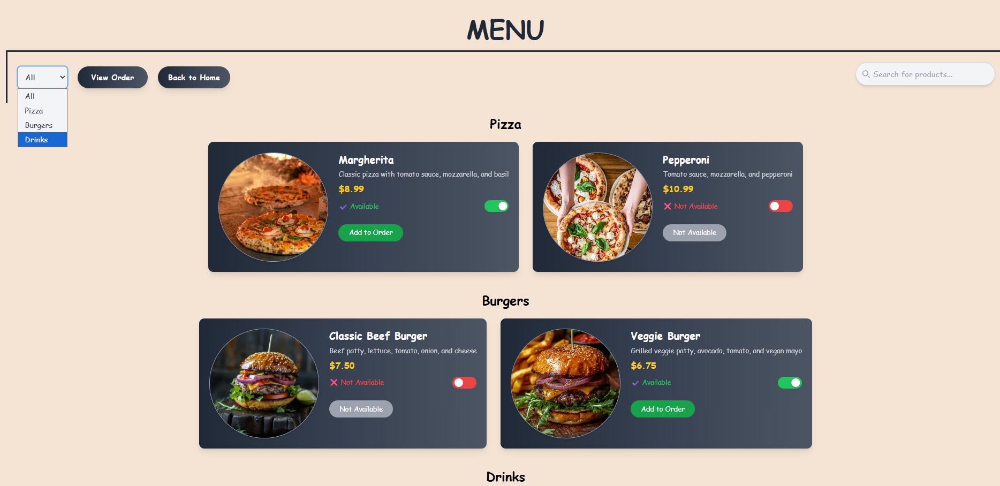
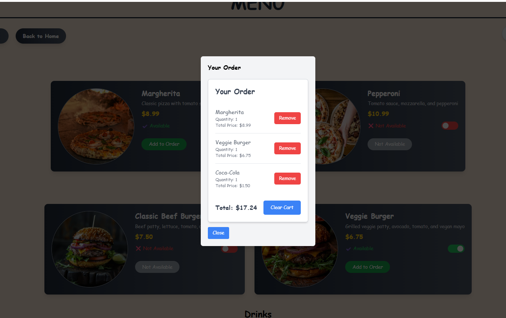

# 🍽️ Digital Menu - Expressoft


## Descriere
This project is a simplified **Digital Menu App** built with **ReactJS**. It's meant to simulate a food ordering interface for a restaurant. This version is provided as a **starter template** for candidates undergoing front-end technical evaluation.

---
## Live Demo
[[Click aici pentru demo live] [(https://expressoft-q7vk.vercel.app/)](https://expressoft-q7vk.vercel.app/)

---

## Funcționalități principale
- Afișarea meniului pe categorii (Pizza, Burgers, Drinks)  
- Carduri pentru produse cu: nume, descriere, preț și indicator de disponibilitate  
- Filtrare produse după categorie  
- Toggle disponibilitate produs (frontend only)  
- Adăugare produse în coș și afișare sumă totală  
- Home page creativ cu opțiune de schimbare limbă și start comandă  

---
## 🚀 Tech Stack

- [Vite](https://vitejs.dev)
- [ReactJS](https://reactjs.org)
- [TypeScript](https://www.typescriptlang.org)
- [Tailwindcss](https://tailwindcss.com)
- [Eslint](https://eslint.org)
- [Prettier](https://prettier.io)

---

## 🧱 Folder Structure (Suggested)

```
src/
├── components/
│   ├── ProductCard.tsx
│   ├── CategoryFilter.tsx
│   └── CartSummary.tsx
├── data/
│   └── menuData.ts
├── pages/
│   ├── Menu.tsx
│   └── Home.tsx
└── App.tsx
```
## Screenshots / Demo GIF




---

## Contact

- Email: agapiandreea53@gmail.com
- LinkedIn: https://www.linkedin.com/in/andreea-agapi-015705216/
- GitHub: [andreeaagai](https://github.com/andreeaagai)

---
## Instalare & Setup
1. Clonează repository-ul:

```bash
git clone https://github.com/andreeaagai/Expressoft.git

